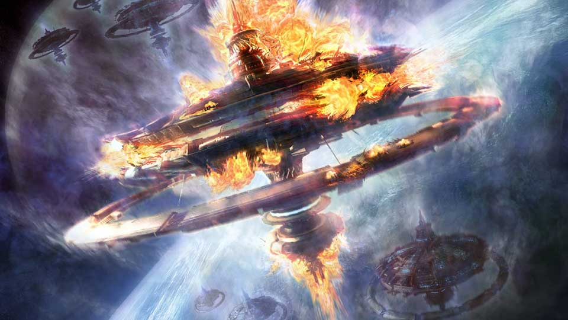

# End of the Line

<figure class="gamecult-media-card">
  
</figure>

Aetheria: Terminus is the first sharp cut into the wider Aetheria universe: a rogue-lite ARPG about crossing a hostile galaxy to win your freedom without having to ship the entire galaxy on day one.

The destination is Terminus. Everything between you and it wants you dead, owned, or broken first. Procedural routes, megacorporate opposition, and the general indifference of space turn every run into a negotiation between risk, speed, and survival, which is a much more manageable problem than solving the whole setting at once.
