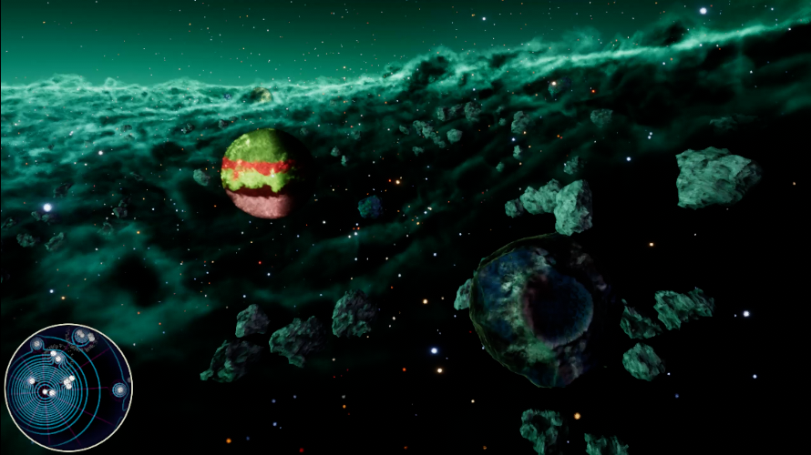

# Aetheria

*"Aetheria is bigger than a wiki, and its publishing surface should be bigger than one too."*

Aetheria is still the flagship world and game project in the GameCult orbit. The dedicated Quartz site at `aetheria.gamecult.org` is the richer long-term home for lore, essays, fiction, and world-specific publishing. This section keeps the older studio-facing pitch alive and points readers toward the deeper vault when they want more.

  <section class="gamecult-hero-panel">
    
Flagship world, broader surface.

    
The old GameCult site pitched Aetheria as the largest and most ambitious project in the portfolio: part social simulation, part action RPG, part excuse to build a galaxy weird enough to deserve years of writing. That still tracks.

    
These pages preserve the concise root-site version of that pitch. The dedicated Aetheria site handles the denser worldbuilding.

  </section>
  <figure class="gamecult-media-card">
    
    
The root site gives the overview. The subsite gets to be expansive.

  </figure>

## Legacy Snapshot

- [End of the Line](/Aetheria/end-of-the-line)
- [Welcome to Elysium](/Aetheria/welcome-to-elysium)
- [A Different Sort of Space](/Aetheria/a-different-sort-of-space)
- [Ship-shape and Up to Specs](/Aetheria/ship-shape-and-up-to-specs)

## Publishing Surfaces

- [Publishing Surfaces](/Aetheria/Publishing-Surfaces)
- [Projects](/Projects/)
- [Blog](/Blog/)
