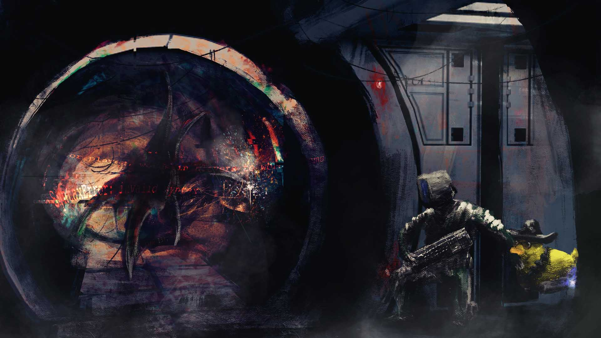

# Democratizing Gamedev

<figure class="gamecult-media-card">
  
  
The original pitch was simple: if a task exists, people should be able to see it, volunteer for it, and be rewarded for completing it.

</figure>

Getting paid to work on open source games? That was always the audacious part of the GameCult pitch.

The legacy site framed this in terms of bounty-driven development. When something needs to get done, it becomes a visible issue with a visible reward. Contributors can step in, do the work, and have that work recognized both financially and organizationally instead of being treated like free invisible labor.

The same pitch also tied participation to governance. Community members were not meant to be passive spectators. They were meant to be able to propose ideas, support priorities, and eventually grow into a more formal stake in the organization once their history of patronage or contribution made that meaningful.

That exact system still needs modern implementation and a lot of refinement, but the studio idea behind it survives the CMS migration just fine: game development should be more legible, more permeable, and less dependent on closed inner circles.
