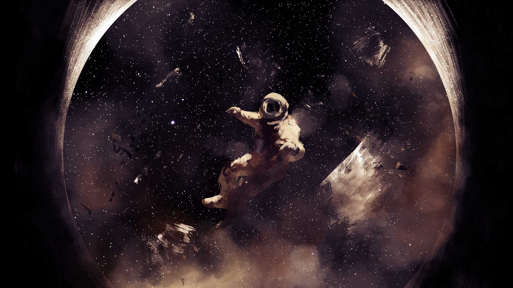

# The New Hotness

<figure class="gamecult-media-card">
  
  
The studio pitch was never about chasing the familiar safest idea. It was about trying to make something worth remembering.

</figure>

Gamers can spot a copycat. If a new project runs on the exact same rails as the current favorite, there is not much reason to jump ship no matter how polished the imitation might be.

The older GameCult copy leaned hard into originality, risk, and the cliff-edge feeling of trying to build something new in a crowded space. That language was dramatic, but the instinct behind it still holds up. The studio should not exist just to reproduce what already wins by default. It should exist to take weird swings and make them legible enough that other people can join in.
