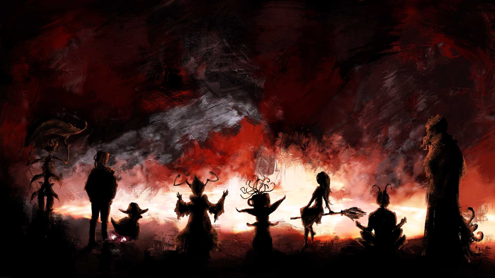

# A Place for Everyone

<figure class="gamecult-media-card">
  
  
Game development is not just code. It is art, writing, music, design, worldbuilding, ops, and all the connective tissue in between.

</figure>

There are many talented people out there who are not cut out for 9-to-5 life, office theater, or the corporate version of "professional." We welcome those people. We are those people. GameCult values the unusual and has no interest in sanding it flat.

Game development is one of the few art forms big enough to use almost everything: storytelling, drawing, music, design, architecture, community care, production, research, and all the connective tissue between them. Writing good code has never been enough.

That breadth is the point. A studio like this should have room for hybrid talents, difficult weirdos, and people whose best work happens outside conventional boxes.
