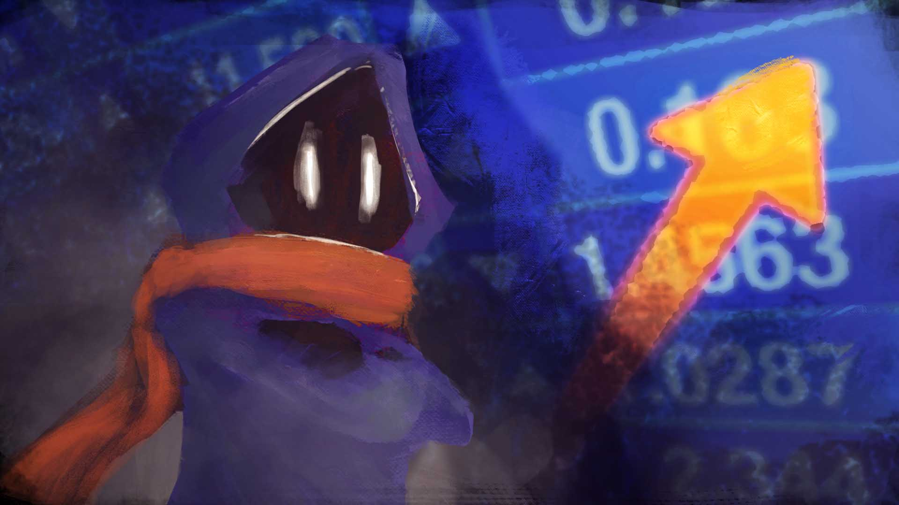

# GameCult

*"Open source game development, cooperative by instinct, strange by design."*

GameCult is a distributed game studio building open worlds, competitive experiments, fiction, and the systems that let players and contributors matter. The work spans flagship settings like Aetheria, sharper standalone ideas like CultPong and Metamorphosis, and the operational thinking required to make a studio like this actually function.

  <section class="gamecult-hero-panel">
    
Open by default. Weird on purpose.

    
We believe information wants to be free, contributors deserve visibility, and artistic integrity matters more than sanding every project into something market-safe and forgettable.

    
GameCult is built for programmers, writers, artists, musicians, designers, worldbuilders, organizers, and the gloriously non-corporate.

    

      

        <h3>Open by default</h3>
        
Source, docs, and public writing should be inspectable, linkable, and easy to revise in Git.

      

      

        <h3>Transparent work</h3>
        
Contributors should be able to see what matters, what needs doing, and where the effort goes.

      

      

        <h3>Flagships and experiments</h3>
        
Aetheria is the flagship world, but CultPong, Metamorphosis, and stranger experiments belong under the same roof.

      

      

        <h3>Cooperative instincts</h3>
        
The studio should answer to the people building and supporting the work, not only to executives and middlemen.

      

    

  </section>
  <figure class="gamecult-media-card">
    
    
The mascot settles the palette question better than memory ever was going to: dark navy and indigo for the base, orange and amber for the warm accent, and electric blue as the sharper signal color.

  </figure>

## Start Here

- [Studio](/Studio/)
- [Projects](/Projects/)
- [Blog](/Blog/)
- [Docs](/Docs/)
- [Aetheria](/Aetheria/)

## Studio Pillars

- [Open Source Model](/Studio/Open-Source-Model)
- [Democratizing Gamedev](/Studio/democratizing-gamedev)
- [A Place for Everyone](/Studio/a-place-for-everyone)
- [Games as a Service](/Studio/games-as-a-service)
- [The New Hotness](/Studio/the-new-hotness)
- [Labor Platform](/Docs/labor-platform)

## Current Projects

- [Aetheria](/Aetheria/)
- [CultPong](/Projects/CultPong)
- [Metamorphosis](/Projects/Metamorphosis)

## Writing

- [Hello, World!](/Blog/hello-world)
- [Rain](/Blog/rain)
- [When We Get Home](/Blog/when-we-get-home)
- [Cat and the Chocolate Factory](/Blog/cat-and-the-chocolate-factory/)
