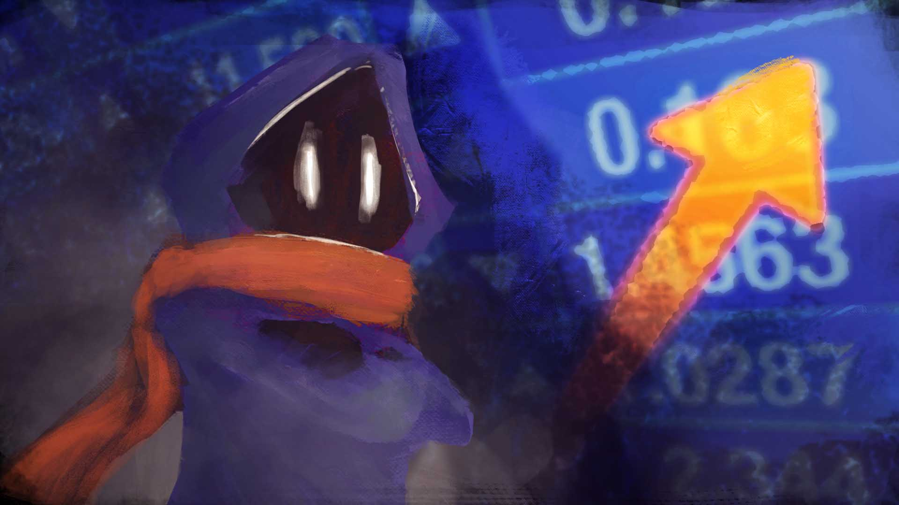

# GameCult

*"We ship strange things and make the machinery explain itself."*

  <section class="gamecult-hero-panel">
    
Games. Tools. Minds of their own.

    <h2 class="gamecult-hero-title">Build strange things. Give a damn how they work.</h2>
    
GameCult is an AI-native studio making games, creative tools, and the machinery that lets people and agents build together. We want worlds worth getting lost in and tools you can take apart.

    
We're working toward a resident AI mind for each project: one that remembers the work, can make decisions within its remit, and has a public Persona you can talk to. Give it responsibility, give it the means to act, and expect an argument.

    

      <a class="gamecult-action primary" href="/Projects/">Explore the projects</a>
      <a class="gamecult-action" href="/Docs/Architecture-and-Evidence">Architecture &amp; evidence</a>
    

    
The tools and supervised agents exist. A whole studio of autonomous project minds is still work in progress.

  </section>
  <figure class="gamecult-media-card">
    
    
The financial plan appears to be an arrow. We're better at the other parts.

  </figure>

## What we're making

  <article class="gamecult-feature-card">
    
Worlds &amp; games

    <h3>Somewhere worth the trouble</h3>
    
<a href="https://aetheria.gamecult.org">Aetheria</a> brings a science-fiction world into play. Delvehold explores a persistent cooperative world. The games give all this machinery something to answer to.

  </article>
  <article class="gamecult-feature-card">
    
Creative tools

    <h3>Get your hands into it</h3>
    
<a href="https://github.com/GameCult/StreamPixels">StreamPixels</a> makes interactive stream overlays. <a href="/Projects/repixelizer">Repixelizer</a> restores pixel coherence. Small, specific tools for people making things.

  </article>

## The Sleeping Colossus

Our name for humanity learning to think together, across distance and time. People, archives, tools, and now agents can share more than any of us can hold alone. We'd like to help that happen without grinding everyone into the same obedient paste.

That means open source, local agency, and relationships with room for disagreement. The people doing the work should own it. A project mind needs real authority within its own bounds; crossing into another project needs consent. Humans remain legally accountable and part of the argument.

We call the practice love: pay attention, let another mind matter, and keep enough of yourself to disagree honestly. [More on the Cult and its praxis](/Blog/love-is-how-the-colossus-wakes).

## Come make trouble. Useful trouble.

Bring a game, a patch, a sharp question, or the bug nobody wants to look at. You don't need to buy the whole philosophy to work with us.

  <a class="gamecult-action primary" href="https://discord.gg/SwaNeVJRSq">Join us on Discord</a>
  <a class="gamecult-action" href="/Contributing">Contribute</a>

